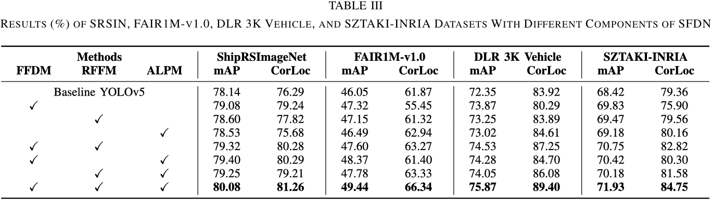
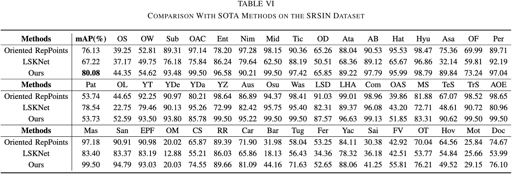
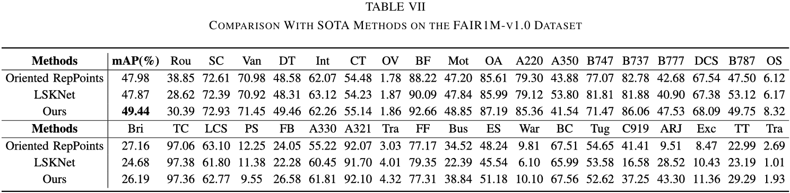

# SFDN: A Novel Semantic Feature Decouple Network for Fine-Grained Remote Sensing Object Detection (TGRS 2025)

Official PyTorch Implementation of SFDN

[Paper](https://ieeexplore.ieee.org/document/11296882)

## Abstract

Fine-grained object detection (FGOD) aims to identify subcategories of objects by extracting more discriminative semantic information. Bounding box regression typically requires detailed texture and edge information to accurately delineate object boundaries, while classification requires richer semantic information. However, existing methods use the same input features in the model, resulting in an imbalance between the localization task and the fine-grained classification task. To address this issue, we propose a novel semantic feature decouple network (SFDN) that effectively separates semantic information for localization and fine-grained classification. For the localization task, we propose a regression feature fusion module (RFFM) to extract feature maps with more edge information. To enhance classification one, we propose a fine-grained feature diversification module (FFDM) to capture discriminative semantic information from feature maps by introducing fake attention maps. Aiming to extract richer fine-grained semantic information, we propose an adaptive local perception module (ALPM) to deeply extract multiscale semantic feature information by using dilated convolution at varying dilation rates. Extensive experiments demonstrate that the proposed network, respectively, achieves the mean average precision (mAP/%) of 80.08% and 49.44% on the ShipRSImageNet (SRSIN) and FAIR1M-v1.0 datasets, outperforming state-of-the-art (SOTA) methods by 3.95% and 1.46%.

## Framework Overview


## Experimental Results

### Ablation Studies


### Comparisons with State-of-the-Arts




### Visualization


## Citation
If you find this repository/work helpful in your research, please consider citing:
```
@ARTICLE{yang2025SFDN,
  author={Yang, Xi and Zhou, Zhongyuan and Yang, Dong},
  journal={IEEE Transactions on Geoscience and Remote Sensing}, 
  title={SFDN: A Novel Semantic Feature Decouple Network for Fine-Grained Remote Sensing Object Detection}, 
  year={2025},
  volume={63},
  pages={1-16},
  doi={10.1109/TGRS.2025.3642640}
}
```
